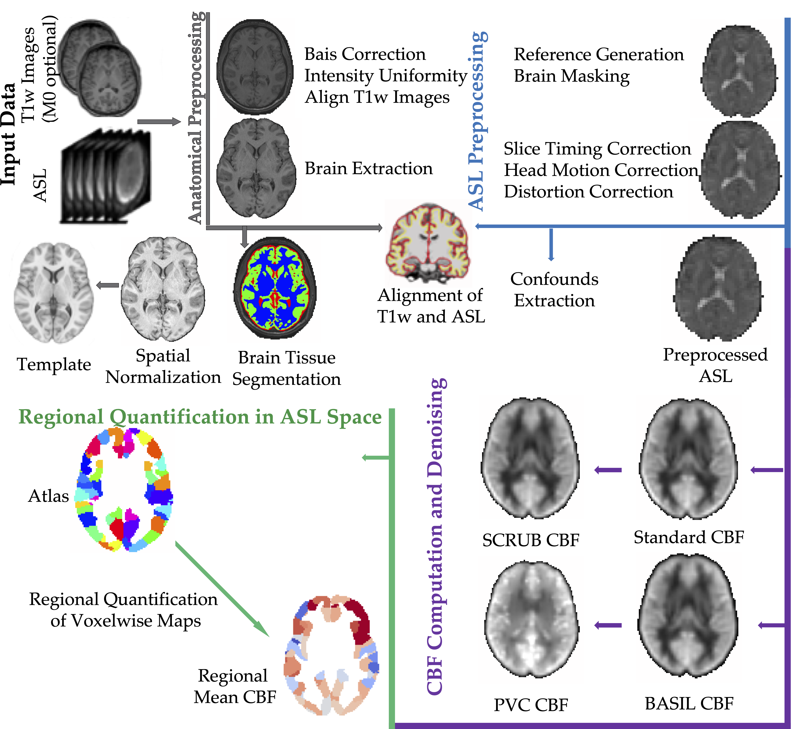

# Data and Figures for the ASLPrep manuscript

This repository contains the code and the data used for the ASLPrep paper.
### Datasets sources

Five datasets were used for this study. All the data were in [BIDS](https://bids-specification.readthedocs.io/) format:

1. PNC dataset : Publicly available on [dbGAP](https://www.ncbi.nlm.nih.gov/projects/gap/cgi-bin/study.cgi?study_id=phs000607.v3.p2)

2. NKI dataset : Publicly available on [NeuroImaging Tools and Resources Collaboratory](http://fcon_1000.projects.nitrc.org/indi/pro/nki.html)

3. IRR dataset : Irritablity data is available upon request from the [PennLinc](https://www.pennlinc.io/team)

4. FTD dataset : Frontal-Temporal Degeneration data is available upon request from [Penn Frontotemporal Degeneration Center](http://ftd.med.upenn.edu)

5. AGE dataset : Publicly available on [Open Neuro](https://openneuro.org/datasets/ds000240/versions/00002)

### Data Preprocessing
All data were preprocessed with the ASLPrep singularity image on the [CBICA](https://www.med.upenn.edu/cbica/cubic.html) HPC cluster. Here is a broad overview of the preprocessing steps:

The processing script for all the datasets is organized in this [directory](scripts).

#### PNC data processing
  1. The PNC data were copied from [RBC](https://github.com/PennLINC/RBC).
  2. The fieldmap metadata were corrected with this 
  [script](scripts/pncdata/fieldmappnc.py) and the ASL data were renamed according to ASL-BIDS specifications.
  2. All subjects were [processed by ASLPrep](scripts/pncdata/run_aslprep.sh).
  3. Computing time for both anatomical preprocessing and perfusion processing were noted.

#### NKI data processing
  1. Similarly, the NKI data were copied from [RBC](https://github.com/PennLINC/RBC).
  2. All subjects were [processed by ASLPrep](scripts/nkidata/run_aslprep.sh).
  3. Computing time for both anatomical preprocessing and perfusion processing were noted.

#### IRR data processing
  1. The IRR data were exported from [flywheel](https://upenn.flywheel.io/). The fieldmap metadata were corrected with this [script](/scripts/grympydata/grmpyinetendedfor.py) and the ASL data were renamed according to ASL-BIDS specifications.
  2. All subjects were [processed by ASLPrep](scripts/grympydata/run_aslprep.sh).
  3. Computing time for both anatomical preprocessing and perfusion processing were noted.

#### FTD data processing
  1. The FTD data were copied from the [PMACS](https://www.med.upenn.edu/pmacs/) cluster with permission.
  2. All subjects were [processed by ASLPrep](scripts/ftddata/run_aslprep.sh).
  3. Computing time for both anatomical preprocessing and perfusion processing were noted.

#### AGE data processing
  1. The AGE data were downloaded from [Open Neuro](https://openneuro.org/datasets/ds000240/versions/00002).
  2. All subjects were [processed by ASLPrep](/scripts/ageingdata/run_aslprep.sh).
  3. Computing time for both anatomical preprocessing and perfusion processing were noted.

## Mean Cerebral Blood Flow(CBF)
The mean CBF within Grey Matter (GM)  and  White Matter (WM) masks were extracted from all the subjects and with each of the 5 CBF methods. These mean CBF values were plotted for all the datasets as shown in Figure 2A and Supplementary Figure 4. The anticipated nonlinear decline of CBF over the lifespan was clearly evident as shown in Figure 2B and Supplementary Figure 5. The summary of this analysis is summarised in this [notebook](/FigureA.ipynb)

